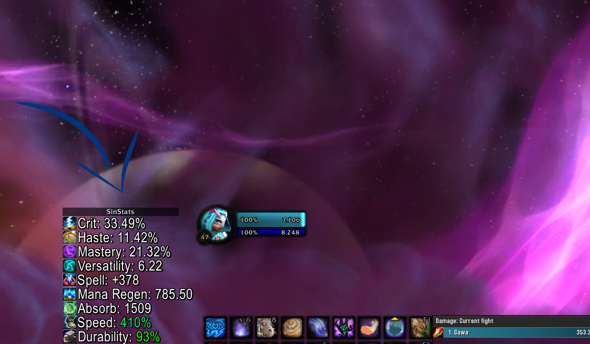
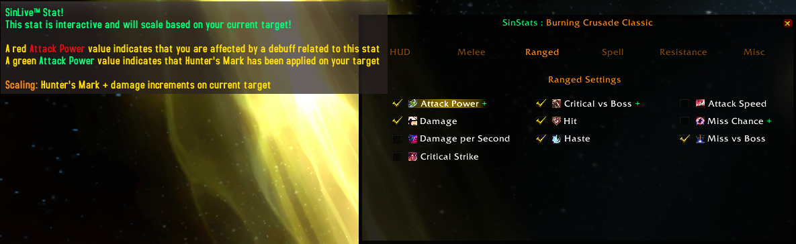
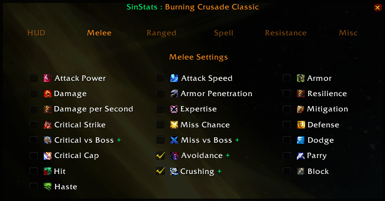

# SinStats
MIRROR : https://www.curseforge.com/wow/addons/sinstats  

SinStats is a lightweight yet powerful addon made for World of Warcraft Classic Era, Burning Crusade and Shadowlands that displays a large range of stats, updated in real-time on a moveable frame that can be placed anywhere on your screen.  

 
## REAL-TIME STATS : ABSOLUTE ACCURACY!

A number of **abilities, talents, enchants, consumables, tier set bonuses, racials, procs, buffs and world buffs** have been manually added and used to provide an unmatched accuracy.  
The HUD was designed to reflect your actual numbers in real-time, as they are at any moment during combat (or outside of combat!).  
If you use all your cooldowns on a boss fight, your stats will reflect the improved numbers! Some of these stats will even scale based on your target level!

 
## INTRODUCING SinLive™, taking stats to the next level!

SinLive™ stats are dynamic stats that react to your current target.
These stats will scale based on the target level and the beneficial debuffs that are applied.

Eg. The attack power of Hunter's Mark will be reflected on the Range Attack Power. Increments are also added.
Canceling the target selection will return the values back to default.

Tooltips on the Settings have been updated. Hover any stat to get more info.
These stats will have a (+) sign next to them on the Settings menu.

 
## FEATURES OVER 60 STATS TO CHOOSE FROM!

* Attack Power : Melee and Ranged 
* Attack Power against Undead : Melee and Ranged [Classic Only]
* Damage : Melee and Ranged
* Damage per Second : Melee and Ranged [BCC Only] **New**
* Critical Strike : Melee, Ranged and Spell
* Critical Strike vs Boss Levels : Melee, Ranged and Spell [BCC] **New**
* Critical Strike Cap : Melee [Classic and BCC]
* Haste : Melee, Ranged and Spell
* Armor Penetration : Physical Damage [BCC]  **New**
* Resilience : Offensive and defensive [BCC]
* Expertise : Main-Hand and Off-Hand [BCC]
* Crushing Blow : [BCC] **New**
* Mastery : [Retail]
* Versatility : [Retail]
* Avoidance : [Retail and BCC]  **New**
* Leech : [Retail]
* Attack Speed : Melee
* Hit Chance : Melee, Ranged and Spell [Classic and BCC]
* Miss Chance : Melee, Ranged and Spell [Classic and BCC]
* Defense : Armor, Mitigation, Block, Parry, Dodge and Defense [Classic and BCC]
* Absorb : Amount of damage to be absorbed [Retail]
* Stagger : [Retail]
* Spell Power : Fire Power, Nature Power, Frost Power, Healing Power, Shadow Power, Holy Power and Arcane Power [Classic, BCC and Retail]
* Spell Power against Undead : All school of magic [Classic]
* Mana Regeneration : Mana Regen per tick (while not casting), Mana Regen per tick (while casting) and MP5 [Classic, BCC and Retail]
* Energy Regeneration : Energy regen per second [Retail]
* Spell Resistance : Fire, Frost, Arcane, Nature and Shadow [Classic and BCC]
* Other Stats : Movement speed, Items Durability, FPS and Latency [Classic, BCC and Retail]

 
## MOD SETUP : QUICK & EASY!

Open Settings : **/sinstats, /ss** or use the **minimap button**

 
## FAQ

**Q: What versions of WoW is SinStats compatible with ?**  
A: SinStats currently supports all WoW versions, including Classic, Burning Crusade and Shadowlands.

**Q: How do I configure my stats ?**  
A: Simply type /sinstats or /ss in the game to open the menu. You can also open the settings by clicking on the minimap button.

**Q: Can I align my stats on multiple rows ?**  
A: Yes, you can align your stats on up to 5 rows. Simply go to the general settings, select Vertical on the Text Alignment option and a slide bar will appear, letting you select the number of rows.

**Q: What is the Text Style option ?**  
A: This options allows you to switch between normal text to an abbreviated version of that stat text for a better fit in certain UI setups. For example, if the Text Style is toggled to "Short", the text of the stat Avoidance will then become AVD.

**Q: What is the difference between MP5 and MP2 ?**  
A: MP5 is your mana regeneration every 5 seconds, coming from from enchants, tier set bonuses, gear, talents and consumables. MP2 uses the same calculations but instead reflect the mana regeneration on your mana bar, per tick.

**Q: What is Mana Regen / Casting Regen ?**  
A: Mana Regen stat shows your actual mana regeneration, per tick (2-sec) and includes every modifier in the game. Casting Regen stat shows your mana regeneration while you're casting, in other words outside of the 5-second rule. It aslo includes every modifier possible and is shown per tick to reflect your mana bar.

**Q: Why is my Spell Power number different than other addons ?**  
A: SinStats will show your actual damage, not just the generic value from gear. For example, a Fire Mage with the Fire Power talent (10% increased fire damage) and a Darkmoon Faire Damage buff will get a 20% increase on its Fire Spell Power stat.

**Q: Is there a way to get more specifics on a stat's functionality ?**  
A: Absolutely. Simply go the settings menu (/sinstats), mouse over the stat that you want to inquire and read the tooltip.

**Q: Some stats on some characters have a number in (), what does it represent ? [ie. Spell Crit : 10% (+3)]**  
A: Some talents only affect one school of magic on a stat. For example, a Priest has talents that will only increase their holy critical strike. This amount will be shown in parenthesis next to the stat. Please go to the settings (/sinstats) and hover the stat in question. A tooltip will appear with some explanation.

**Q: Do racials like Berserking and world buffs such as Warchief's Blessing affect the new Haste Bonus stat ?**  
A: Yes, every (almost) haste related spell in the game has been added. If some are missing, they will be added shortly.

**Q: Is it possible to toggle off the icons next to each stat ?**  
A: Yes, the icons can be toggled off via the settings menu (/sinstats)

**Q: Is it possible to toggle off the minimap button ?**  
A: Yes, the minimap button can be toggled off via the settings menu (/sinstats)

 

 
